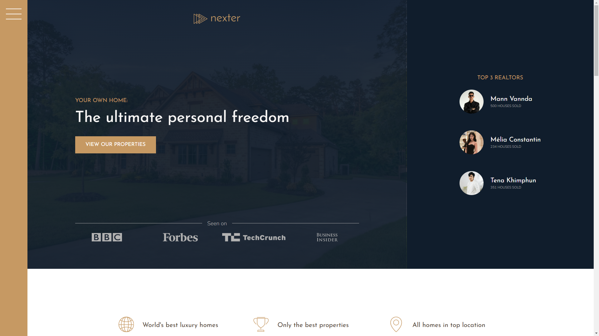

# Nexter: Your Home, Your Freedom 🏡

Nexter is a fictional, sleek and modern real estate platform designed to help users find their dream homes. This project showcases a portfolio of luxurious properties and highlights key real estate services, making home acquisition effortless and enjoyable.

## 🖼️ Screenshots

### Screenshot 1


### Screenshot 2


### Screenshot 3


## 🌟 Features

- **Stunning Property Listings**: Explore family homes, modern villas, country houses, and apartments with detailed specifications like size, location, and pricing.
- **Top Realtors**: Meet trusted professionals who ensure a seamless buying experience.
- **Secure Transactions**: Prioritize safety and convenience with secure payment options.
- **Modern Design**: A visually appealing and responsive user interface.

## 🎯 Purpose

The aim of Nexter is to showcase a professional real estate web application using cutting-edge web technologies with a focus on clean, maintainable code and responsive design.

## 🛠️ Tech Stack

- **HTML5**: Semantic structure for web content.
- **SASS (SCSS)**: Powerful CSS preprocessor for modular, reusable, and maintainable styles.

## 🏗️ Installation & Setup

To view or modify this project locally:

1. Clone the repository:
   ```bash
   git clone https://github.com/BothSann/nexter-website.git

## 🛠️ Built By

This project was built by **THANN SOPHEAKBOTH** as part of an online learning course by [Jonas Schmedtmann](https://codingheroes.io/).

---

## ©️ Copyright By

© Copyright by **Jonas Schmedtmann**. This project is for educational purposes only and cannot be used for commercial purposes.
